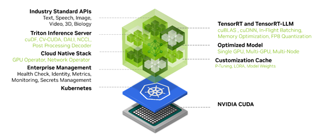
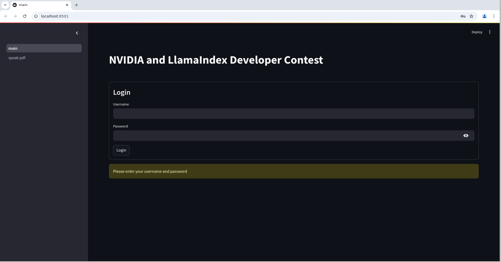
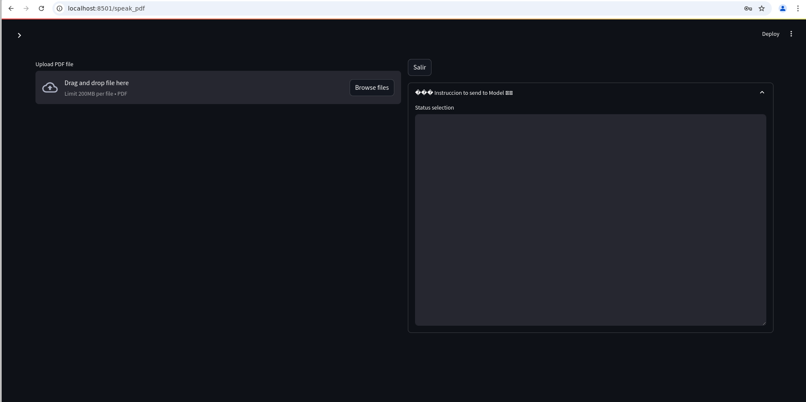
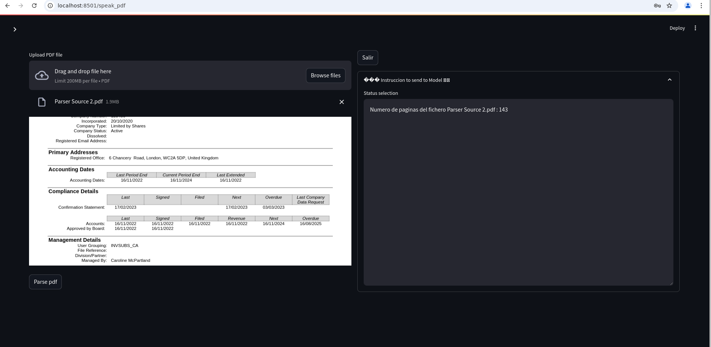
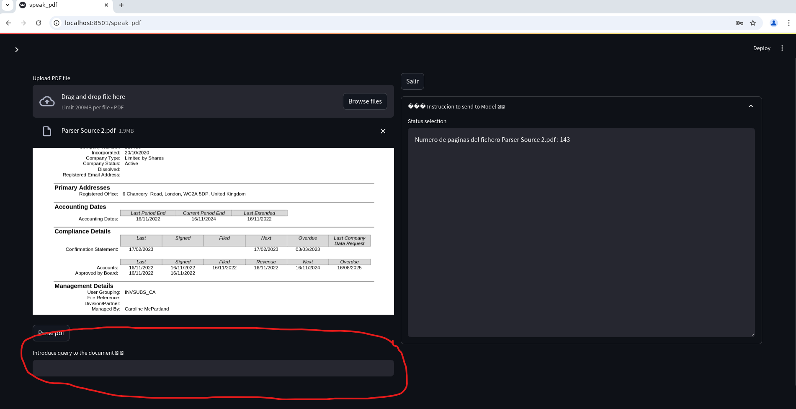
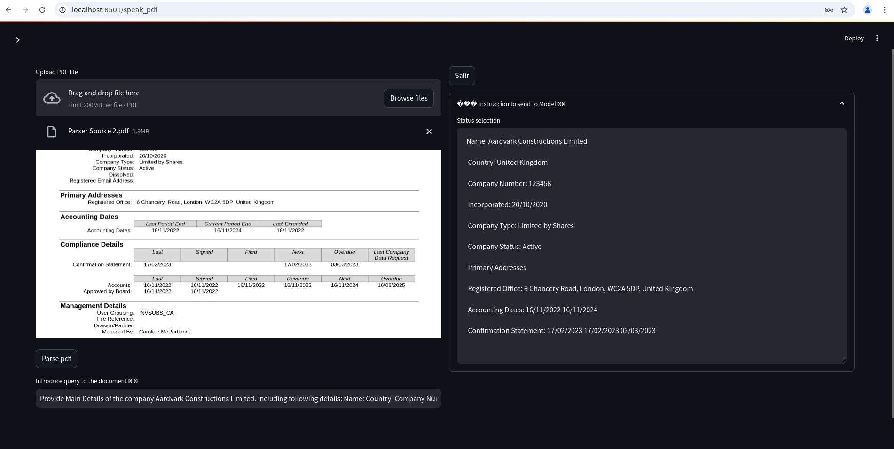
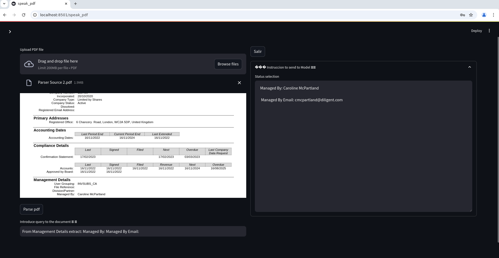
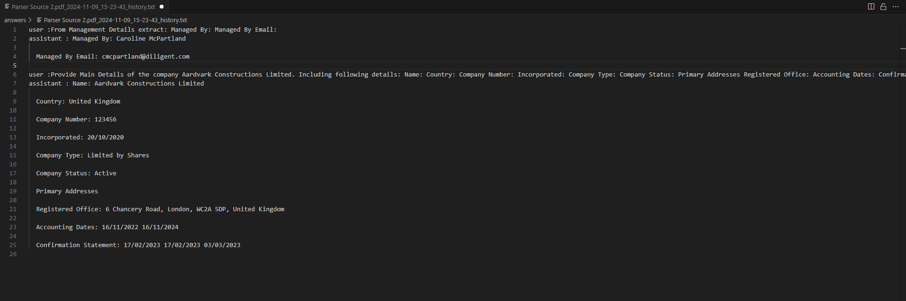

# NVIDIA and LlamaIndex Developer Contest
In this repository I have the submission to the "NVIDIA and LlamaIndex Developer Contest", for reference https://developer.nvidia.com/llamaindex-developer-contest

## Description
I have created a small RAG application which allow to extract information from unstructured data. In this case from pdf files, but with few modifications we can extend its functionality to extract from other formats. The best description of this application is "Speak with your Data"

Main Technolgies use in this application are:
- Nvidia NIM 
- LLamaIndex
- StreamLit
- Docker
- Python 3.11

# Nvidia NIM
NIM is a set of optimized cloud-native microservices designed to shorten time-to-market and simplify deployment of generative AI models anywhere, across cloud, data center, and GPU-accelerated workstations. It expands the developer pool by abstracting away the complexities of AI model development and packaging for production ‌using industry-standard APIs.
https://developer.nvidia.com/blog/nvidia-nim-offers-optimized-inference-microservices-for-deploying-ai-models-at-scale/

https://docs.api.nvidia.com/nim/reference/llm-apis



# LLamaIndex
LlamaIndex is a framework for building context-augmented generative AI applications with LLMs including agents and workflows.

https://docs.llamaindex.ai/en/stable/


# Models

### Embeddings nvidia/embed-qa-4
```
Architecture Type: Transformer
Network Architecture: Fine-tuned E5-Large-Unsupervised retriever
Embedding Dimension: 1024
Parameter Count: 335 million
```
https://build.nvidia.com/nvidia/embed-qa-4/modelcard 


### LLM,s From NGC
You need to create an account in NGC and there access to NIM Dashboard and there generate an NVIDIA_API_KEY
I have my Nvidia API key in a .env file and either in the APP or the Notebook I load it into the environment variables
```
from dotenv import dotenv_values
import os
# read env file
ROOT_DIR = os.getcwd()
config = dotenv_values(os.path.join(ROOT_DIR, "keys", ".env"))
os.environ['NVIDIA_API_KEY'] = config.get('NVIDIA_API_KEY')
```

*To access models just instantiate the objects NVIDIA and NVIDIAEmbedding after setting the NVIDIA_API_KEY to the object Settings of LLamaIndex*

ex:
```
from llama_index.core import Settings
from llama_index.llms.nvidia import NVIDIA
from llama_index.embeddings.nvidia import NVIDIAEmbedding

Settings.embed_model = NVIDIAEmbedding(model="NV-Embed-QA", truncate="END")

# Here we are using meta/llama-3.2-3b-instruct model from API Catalog
Settings.llm = NVIDIA(model="meta/llama-3.2-3b-instruct", temperature=0.7)

```

#### In Demo LLM Microsoft Phi3 3.5 128K

Phi-3.5-mini is a lightweight, state-of-the-art open model built upon datasets used for Phi-3 - synthetic data and filtered publicly available websites - with a focus on very high-quality, reasoning dense data. The model belongs to the Phi-3 model family and supports 128K token context length. The model underwent a rigorous enhancement process, incorporating both supervised fine-tuning, proximal policy optimization, and direct preference optimization to ensure precise instruction adherence and robust safety measures.

https://huggingface.co/microsoft/Phi-3.5-mini-instruct

https://github.com/microsoft/Phi-3CookBook


### Notebook Include LLama 3.2 3b Instruct

The Llama 3.2 collection of multilingual large language models (LLMs) is a collection of pretrained and instruction-tuned generative models in 1B and 3B sizes (text in/text out). The Llama 3.2 instruction-tuned text only models are optimized for multilingual dialogue use cases, including agentic retrieval and summarization tasks. They outperform many of the available open source and closed chat models on common industry benchmarks.

https://huggingface.co/meta-llama/Llama-3.2-3B-Instruct

#### Note. You need to get access to this model before use. In HugginFace Hub request access to Meta

# Install 
Before Start , you need to have installed Anaconda, Miniconda or other environments manager tool, Vscode and docker Desktop. If you plan to use a GPU in your docker Install Nvidia Container Toolkit (See https://docs.nvidia.com/datacenter/cloud-native/container-toolkit/latest/install-guide.html). I am working in a Debian Distro under WSL 2 , host Windows 11

1. Clone this Repository.
1. Create a python Environment with python 3.11 and activate it
2. If you want to follow the code in Jupyter install jupyter or Jupyter lab and open [this notebook](RAG_LlamaIndex_Nim.ipynb)
3. Install requirements.txt. pip install -r requirements.txt
4. to run the application on a shell : python -m streamlit run main.py
6. If you want to create the docker container run docker build --pull --rm --build-arg user_app=app -f "Dockerfile" -t nim_llamaindex:latest "."


# How to use it

### Authentication Page
Introduce your User and Password . Folllow the procedure in the bottom to create an user in Streamlit



### Go to Speak pdf page
Click on the left Menu speak pdf and page will open



### Choose PDF to speak with

Click in browse files in the Upload PDF file Component and the pdf visualizer will appears. You can scroll down and up to visualize the content of the pdf



### Parse PDF
Click on Parse PDF and this internally will use pymupdf4llm to convert each page of the document into LLamaIndex Documents. We are using the model "NV-Embed-QA" for embeddings. One we have created the embeddings docs they are stored in the VectorIndex object and persisted to the disk. If the file was already parsed and added to the VectorStore the application will not do anything, just use the VectorStore. The Input box to write your question will appears under the Parse Butom



### Ask the model Something about the document
Write in the input your question to the document and press Enter. The answer from the Model is written in the Text Area on the Right
In this example:
```
Provide Main Details of the company Aardvark Constructions Limited. Including following details:
Name:
Country:
Company Number:
Incorporated:
Company Type:
Company Status:
Primary Addresses Registered Office:
Accounting Dates:
Confirmation Statement:
```



You can ask as much as you want. As it has memory, its remember the company you are asking for

```
From Management Details extract:
Managed By:
Managed By Email:
```



# Leave the Conversation

Click on button Salir (Leave Conversation) above the Text area on the Right and it close  the current Conversation. The application will save your conversation on the folder answers ina txt file with the format filename_YYYY-MM-DD_H-M-S_history.txt

Example this session




# TODO
- Improve the control of files in the vectorstore
- Maps volumen to folders in Docker Container
- Include other formats and made the bot multimodal


# How to create Users and Passwords to this app

create a yaml file with name config.yaml in the keys folder
here you have and example with 2 users user1 and nvidiademo
```
credentials:
  usernames:
    user1:
      email: test@gmail.com
      name: user1 
      password: $2b$12$ZoeMqMyYQZqFGM7iF2bugeYG3E1kL7RA8jLkTvPcpdIlpIz46Yz/i # To be replaced with hashed password
    nvidiademo:
      email: demo@nvidia.com
      name: nvidiademo
      password: $2b$12$vL2J2PauSXISet6wZIM0j.DFZdq7cyrJ/2TQEn8UT.NyxZuKGfEZa # To be replaced with hashed password
cookie:
  expiry_days: 0
  key: laPalma50 # Must be string
  name: thecokkei
  ```


  ###### To generate the hashes
  - Go to the folder hasher and edit the file ex.yaml
  - Fill email , name and password with your values
  - Run hasher.py
  - Replace the password in config.yaml with its hash value

  ```
  credentials:
  usernames:
    user1:
      email: test@gmail.com
      name: user1 
      password:  text#me
    nvidiademo:
      email: demo@nvidia.com
      name: nvidiademo
      password:  laPalma50 
cookie:
  expiry_days: 0
  key: laPalma50 # Must be string
  name: thecokkei
  ```

  OUTPUT

  ```
  {'usernames': {'user1': {'email': 'test@gmail.com', 'name': 'user1', 'password': '$2b$12$ZoeMqMyYQZqFGM7iF2bugeYG3E1kL7RA8jLkTvPcpdIlpIz46Yz/i'}, 'nvidiademo': {'email': 'demo@nvidia.com', 'name': 'nvidiademo', 'password': '$2b$12$vL2J2PauSXISet6wZIM0j.DFZdq7cyrJ/2TQEn8UT.NyxZuKGfEZa'}}}
  ```